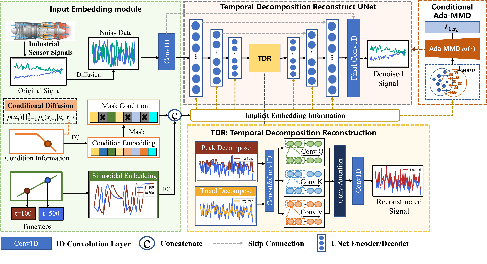

# Diff-MTS: Temporal-Augmented Conditional Diffusion Model For Industrial Time Series

Source codes for the paper "Diff-MTS: Temporal-Augmented Conditional Diffusion-Based AIGC for Industrial Time Series Toward the Large Model Era": [Diff-MTS](https://ieeexplore.ieee.org/document/10697287) [IEEE Transactions on Cybernetics] by Lei Ren, Haiteng Wang, Yuanjun Laili.

Diff-MTS is a novel diffusion-based AIGC model tailored for industrial multivariate time series (MTS). It leverages temporal augmentation and adaptive diffusion techniques to generate high-quality synthetic data, addressing challenges in industrial data generation, including data scarcity, unstable training in GANs, and complex temporal dependencies.




## Usage

1. Clone this repository:
   ```bash
   git clone https://github.com/your-username/diff-mts.git
   cd diff-mts
2. Install 
    ```bash
    pip install -r requirements.txt
3. Training the Model
    Train the Diff-MTS model using the following command: 
    ```bash
    python MainCondition.py --epoch 50 --dataset FD001 --lr 2e-3 --state all --model_name DiffUnet --T 500 --window_size 48 --sample_type ddpm --input_size 14
    ```

## Citation
If you find this code helpful, please cite our paper:
```
@article{ren2024diff,
  title={Diff-MTS: Temporal-Augmented Conditional Diffusion-Based AIGC for Industrial Time Series Toward the Large Model Era},
  author={Ren, Lei and Wang, Haiteng and Laili, Yuanjun},
  journal={IEEE Transactions on Cybernetics},
  year={2024},
  publisher={IEEE}
}
```
```
Ren L, Wang H, Laili Y. Diff-MTS: Temporal-Augmented Conditional Diffusion-Based AIGC for Industrial Time Series Toward the Large Model Era[J]. IEEE Transactions on Cybernetics, 2024.
```

## Acknowledgment
Thanks for the helop of [Chengwen Qi]()

Thanks for the [lucidrains/denoising-diffusion-pytorch](https://github.com/lucidrains/denoising-diffusion-pytorch) project for their support and contributions to this project.

